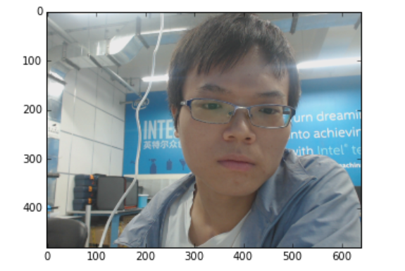
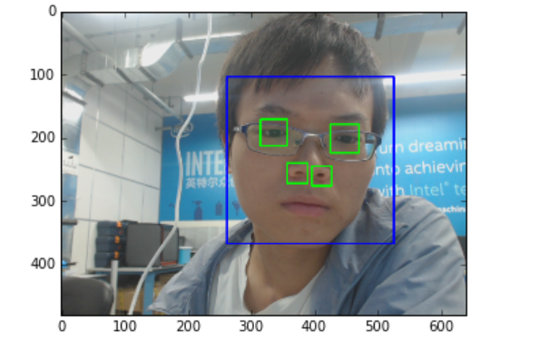

# face_recognition experiment

​	在做这个实验之前，需要准备一个摄像头，将摄像头的USB接口接入FPGA板子即可

　编辑代码，我的代码写在Jupyter的example目录下了，文件为【face recognition by hejinhua】，同时也上传到了本文件的同一目录下

​	测试代码

​    首先，拍摄照片如下

​     

​	进行人脸检测，如下

​	

​	人脸检测成功，达到了预期效果
