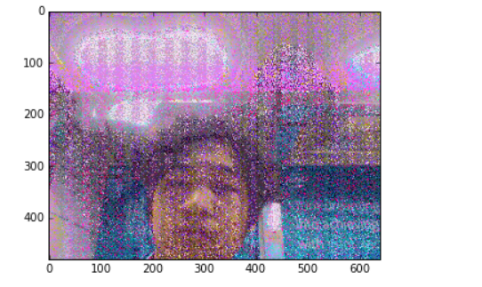
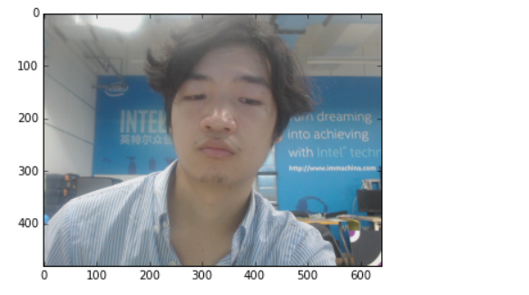

#人脸识别——我的学习日志
##黄静远 2019.7.23

##实验的硬件部分
    同样地，这个实验采用的是pynq板，附加了Logitech的摄像头模块。值得注意的是一开始我将摄像头的usb插口连向了电脑，而实际上应连接pynq板的usb接口。
##实验的代码部分
    这里对原有的代码进行了一个拼接，将脸部检测的系统与播放音频的系统做了一个拼接。其中的代码如下
'''
from pynq.drivers import Audio
if len(faces) > 0:
    pAudio.load("/home/xilinx/pynq/my_recording.pdm")
    pAudio.play()

'''
##实验感想
    最大的感想就是这个摄像头的延时真的有点长（笑）。在基于pynq上的jupyter中运行代码的时候，代码调用的摄像头文件是上一次拍的：举个例子，我前一次运行代码时，是从下往上拍的、这一次调用代码时，用matplotlib画出来就是我的鼻孔（笑）。下面是这一段代码
'''
（#） Capture webcam image
import numpy as np

ret, frame_vga = videoIn.read()
'''
    按理说videoIn.read调用出来的参数是即时，没有一个储存上一次的储存区。我推测的理由可能是摄像头自带有一个存储空间，将之前拍过的最近的一张照片储存以防止数据丢失。

##遇到的问题
    在代码运行的时候还遇到了一个问题，如图

    照片在matplotlib绘制的时候会出现泛红的情况，原因应该是由于jupyter运行代码是分cell的，在运行到下一段代码时，部分通道中的数据丢失了，造成了照片的噪点。解决的方案就是在运行绘制代码时预留足够长的时间，使数据全部存入新变量的存储空间中。这样，照片中的hjy又可以重获全彩的画质了。

