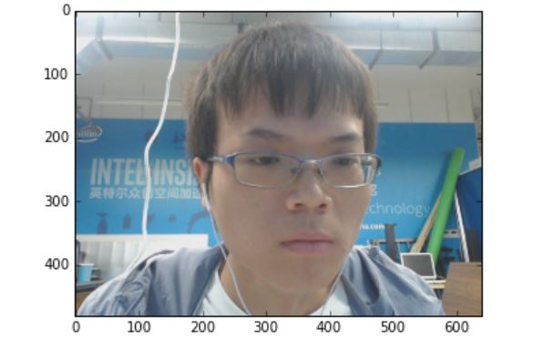
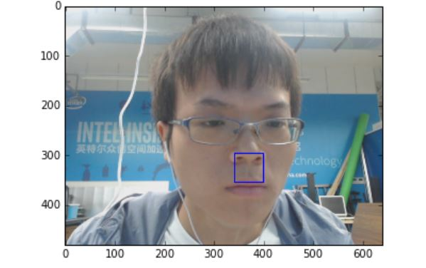
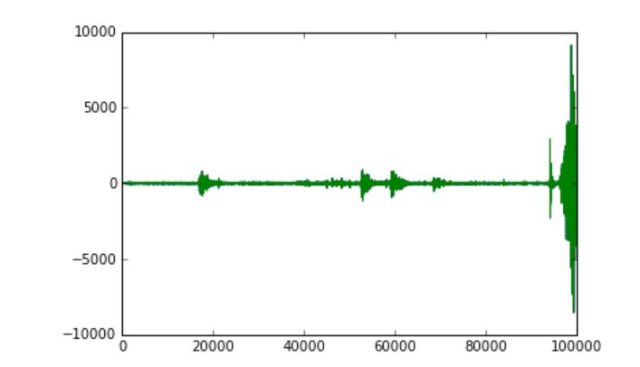

                                         智能迎宾系统

​	在做这个实验之前，需要准备一个摄像头，将摄像头的USB接口接入FPGA板子即可

　编辑代码，我的代码卸载Jupyter的example目录下了，文件为【smart+welcoming+system+by+hejinhua】

​	测试代码

​    首先，拍摄照片如下

​     

​	进行人脸检测，如下

​	

​	人脸检测成功，达到了预期效果

​    检测到人脸，播放音频如下

​     

   遇到的问题及解决办法

​       拍摄的照片有时候质量很差，这是由于未能让拍摄照片的程序段执行足够的时间，以至于抓取的像素点未达到要求，让对应的程序段执行十几秒即可解决该问题。
